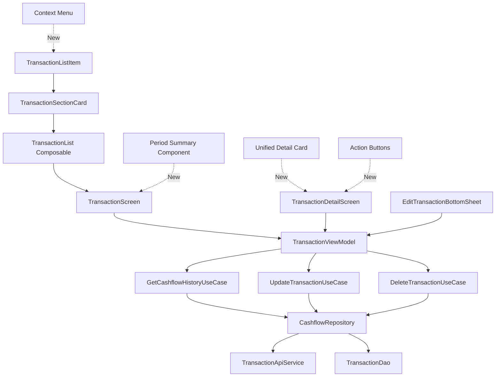
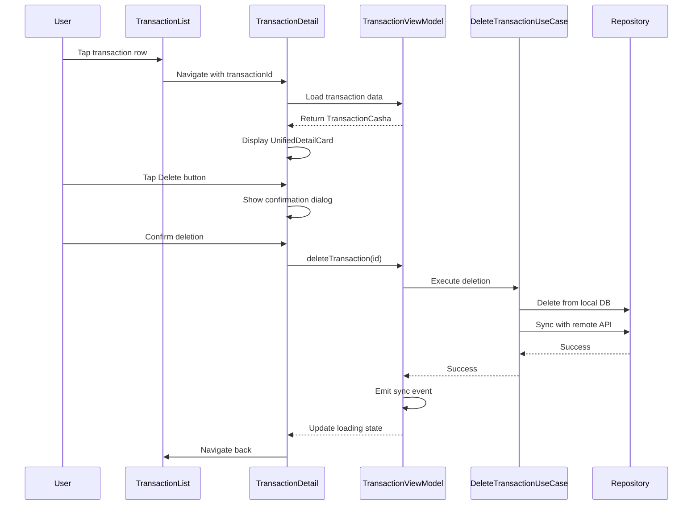
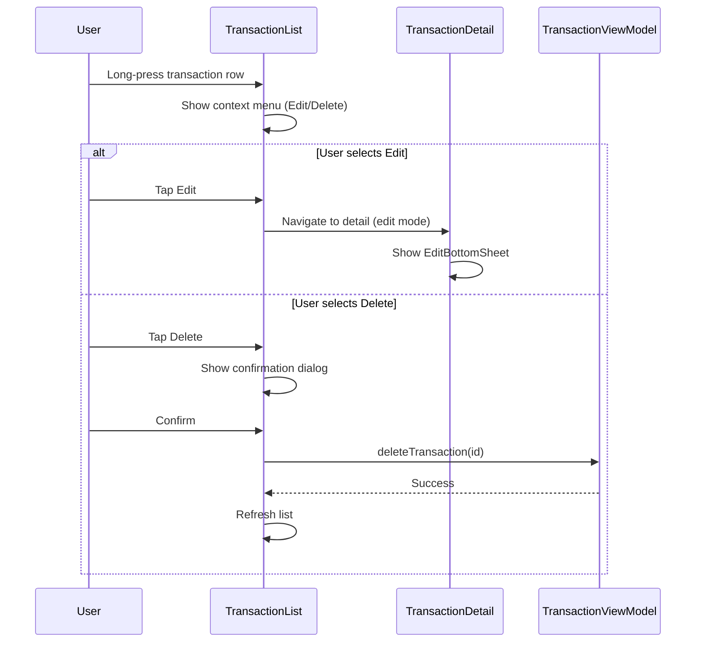

# Design Document: Transaction UX Simplification

## Overview

This design document outlines the Android implementation of UX improvements for the Transaction module in the Casha app. The goal is to reduce visual noise, improve action accessibility, consolidate fragmented layouts, and add helpful summaries to enhance the user experience across the Transaction List, Detail, and Edit flows.

The improvements are based on analysis of the iOS implementation and adapted to Android's Material Design principles and Jetpack Compose architecture. The design focuses on three main screens:

1. **Transaction List Screen** - Reducing redundancy, adding period summaries, and improving filter capabilities
2. **Transaction Detail Screen** - Consolidating 4 separate cards into 1 unified card, improving action accessibility
3. **Transaction Edit Screen** - Removing confusing UI elements and improving sync state handling

## Architecture

The Transaction UX Simplification feature maintains the existing MVVM architecture with Jetpack Compose UI layer:



### Key Architectural Components

- **Presentation Layer**: Jetpack Compose UI components (Screens, Cards, Items)
- **ViewModel Layer**: TransactionViewModel managing UI state with StateFlow
- **Domain Layer**: Use cases encapsulating business logic
- **Data Layer**: Repository pattern with Room (local) and Retrofit (remote)

## Components and Interfaces

### Component 1: PeriodSummaryCard

**Purpose**: Display aggregated financial data for the selected period at the top of the transaction list

**Interface**:
```kotlin
@Composable
fun PeriodSummaryCard(
    totalIncome: Double,
    totalExpense: Double,
    netAmount: Double,
    modifier: Modifier = Modifier
)
```

**Responsibilities**:
- Calculate and display total income for the selected period
- Calculate and display total expense for the selected period
- Calculate and display net amount (income - expense)
- Use color coding to indicate positive/negative net amounts
- Integrate seamlessly with existing filter bar

**Visual Design**:
- Compact card with horizontal layout showing three values
- Green color for income, red for expense, contextual color for net
- Icons for visual clarity
- Padding and elevation matching existing card design

---

### Component 2: TransactionListItem (Enhanced)

**Purpose**: Display individual transaction rows with improved visual hierarchy and context menu support

**Interface**:
```kotlin
@Composable
fun TransactionListItem(
    entry: CashflowEntry,
    onClick: () -> Unit = {},
    onEdit: () -> Unit = {},
    onDelete: () -> Unit = {},
    modifier: Modifier = Modifier
)
```

**Responsibilities**:
- Display transaction information: icon, name, category, amount, time
- **Remove** INCOME/EXPENSE badge (redundant with color coding)
- Add context menu support via `combinedClickable` modifier
- Provide long-press menu with Edit and Delete actions
- Maintain color differentiation through icon background and amount color

**Changes from Current Implementation**:
- Remove type badge Box component
- Add `onEdit` and `onDelete` callback parameters
- Implement `Modifier.combinedClickable` for long-press context menu

---

### Component 3: UnifiedTransactionDetailCard

**Purpose**: Consolidate transaction detail information from 4 separate cards into 1 unified card

**Interface**:
```kotlin
@Composable
fun UnifiedTransactionDetailCard(
    transaction: TransactionCasha,
    cashflowType: CashflowType,
    onEdit: () -> Unit,
    onDelete: () -> Unit,
    modifier: Modifier = Modifier
)
```

**Structure**:
```
┌────────────────────────────────────────┐
│ [Icon 40dp] Transaction Name           │
│             Category • Date, Time      │
│ ────────────────────────────────────── │
│ -Rp 25.000                             │
│ ────────────────────────────────────── │
│ Wallet       BCA                       │
│ Created      27 May 2026, 08:32        │
│ ────────────────────────────────────── │
│ [ ✏️ Edit ]        [ 🗑️ Delete ]       │
└────────────────────────────────────────┘
```

**Responsibilities**:
- Display compact icon (40dp instead of 80dp)
- Show transaction name and metadata inline
- Display amount with contextual color
- Show essential details (wallet, created date)
- **Remove** sync status row (internal technical detail)
- **Remove** updated date (rarely useful)
- **Remove** type badge (redundant)
- Provide direct Edit and Delete action buttons
- Handle button state based on sync status

**Changes from Current Implementation**:
- Merge HeaderSection, AmountStatusSection, CategorySection, DetailsSection into single composable
- Reduce vertical spacing and icon size
- Move actions from toolbar menu to inline buttons
- Remove redundant information displays

---

### Component 4: TransactionDetailScreen (Simplified)

**Purpose**: Host the unified detail card and manage navigation/actions

**Interface**:
```kotlin
@Composable
fun TransactionDetailScreen(
    transactionId: String,
    cashflowType: CashflowType,
    onNavigateBack: () -> Unit,
    onNavigateToEdit: (String) -> Unit,
    viewModel: TransactionViewModel = hiltViewModel()
)
```

**Responsibilities**:
- Load transaction data from ViewModel
- Display UnifiedTransactionDetailCard
- Handle Edit and Delete actions with proper sync state checks
- Show confirmation dialogs for destructive actions
- **Remove** overflow menu (actions moved inline)
- Maintain processing state UI during operations

**Changes from Current Implementation**:
- Replace separate card sections with UnifiedTransactionDetailCard
- Remove TopAppBar actions menu
- Simplify dialog handling
- Improve sync state messaging

---

### Component 5: EditTransactionBottomSheet (Cleaned)

**Purpose**: Allow transaction editing with cleaner, less confusing UI

**Interface**:
```kotlin
@Composable
fun EditTransactionBottomSheet(
    transaction: TransactionCasha,
    cashflowType: CashflowType,
    categories: List<CategoryCasha>,
    onDismissRequest: () -> Unit,
    onSave: (TransactionRequest) -> Unit
)
```

**Responsibilities**:
- Display editable fields: Name, Amount, Category, Date
- **Remove** "Confirmed" toggle (exposes internal sync state)
- Provide Save and Cancel actions
- Validate input before saving
- Use inline sync status indicator instead of toggle

**Changes from Current Implementation**:
- Remove `isSynced` toggle from form
- Add inline "Syncing..." status indicator when transaction is not synced
- Simplify form sections

---

## Data Models

### Existing Models (No Changes)

```kotlin
data class TransactionCasha(
    val id: String,
    val name: String,
    val amount: Double,
    val category: String,
    val datetime: Date,
    val updatedAt: Date,
    val isSynced: Boolean,
    val liabilityId: String?,
    val remoteId: String?
)

data class CashflowEntry(
    val id: String,
    val title: String,
    val category: String,
    val amount: Double,
    val date: Date,
    val type: CashflowType
)

data class CashflowDateSection(
    val day: String,
    val date: String,
    val items: List<CashflowEntry>,
    val segments: List<DisplaySegment>
)
```

### New Computed Properties (Extension Functions)

```kotlin
// Extension function on List<CashflowDateSection> for period summary
fun List<CashflowDateSection>.calculatePeriodSummary(): PeriodSummary {
    val allItems = this.flatMap { it.items }
    val totalIncome = allItems.filter { it.type == CashflowType.INCOME }
        .sumOf { it.amount }
    val totalExpense = allItems.filter { it.type == CashflowType.EXPENSE }
        .sumOf { it.amount }
    return PeriodSummary(
        totalIncome = totalIncome,
        totalExpense = totalExpense,
        netAmount = totalIncome - totalExpense
    )
}

data class PeriodSummary(
    val totalIncome: Double,
    val totalExpense: Double,
    val netAmount: Double
)
```

**Validation Rules**:
- All amounts must be non-negative
- Period summary calculations should handle empty lists gracefully
- Net amount can be negative (expense > income)

---

## Sequence Diagrams

### Main Flow: View Transaction Detail and Delete



### Enhanced Flow: Long-Press Context Menu



---

## Error Handling

### Error Scenario 1: Sync Required for Edit/Delete

**Condition**: User attempts to edit or delete a transaction that has `isSynced = false`

**Response**: 
- Disable Edit and Delete buttons with visual indication
- Show inline status message: "⏳ Syncing with server..."
- Prevent action execution

**Recovery**:
- Auto-enable buttons when sync completes
- Listen to `SyncEventBus` for completion events
- Retry sync via pull-to-refresh if stuck

---

### Error Scenario 2: Delete Operation Fails

**Condition**: Network error or API failure during delete operation

**Response**:
- Show error dialog with descriptive message
- Keep transaction in list
- Roll back any optimistic UI updates

**Recovery**:
- User can retry deletion
- Suggest checking network connection
- Queue operation for retry when network available

---

### Error Scenario 3: Invalid Edit Input

**Condition**: User attempts to save transaction with invalid data (empty name, zero amount)

**Response**:
- Show inline error message on invalid field
- Disable Save button until valid
- Highlight problematic fields in red

**Recovery**:
- User corrects input
- Validation re-runs on field change
- Save enabled when all validations pass

---

## Testing Strategy

### Unit Testing Approach

**Focus Areas**:
- Period summary calculation logic
- Transaction grouping and sorting
- Context menu action callbacks
- Sync state validation

**Key Test Cases**:

1. **Period Summary Calculation**
   ```kotlin
   @Test
   fun `calculatePeriodSummary returns correct totals`() {
       // Given: List of transactions with mixed income/expense
       // When: calculatePeriodSummary() is called
       // Then: Totals match expected values
   }
   ```

2. **Sync State Validation**
   ```kotlin
   @Test
   fun `edit button disabled when transaction not synced`() {
       // Given: Transaction with isSynced = false
       // When: Rendering UnifiedTransactionDetailCard
       // Then: Edit button is disabled
   }
   ```

3. **Context Menu Actions**
   ```kotlin
   @Test
   fun `long press triggers context menu`() {
       // Given: TransactionListItem rendered
       // When: Long press gesture performed
       // Then: Context menu with Edit/Delete shown
   }
   ```

**Coverage Goals**: 80%+ for ViewModels and utility functions

---

### UI Testing Approach (Compose)

**Focus Areas**:
- Component rendering with various data states
- User interaction flows
- Navigation between screens
- Dialog and bottom sheet behavior

**Key Test Cases**:

1. **Period Summary Display**
   ```kotlin
   @Test
   fun `period summary shows correct values`() {
       // Given: TransactionScreen with mock data
       // When: Screen is rendered
       // Then: Period summary card displays correct totals
   }
   ```

2. **Context Menu Interaction**
   ```kotlin
   @Test
   fun `long press shows context menu and delete works`() {
       // Given: Transaction list with items
       // When: User long-presses item and taps Delete
       // Then: Confirmation dialog shown, delete executed
   }
   ```

3. **Unified Detail Card Layout**
   ```kotlin
   @Test
   fun `unified detail card fits without scrolling`() {
       // Given: Transaction detail with standard data
       // When: Rendered on standard screen size
       // Then: All content visible without scroll
   }
   ```

**Coverage Goals**: Critical user paths with Compose UI tests

---

### Integration Testing Approach

**Focus Areas**:
- ViewModel interaction with UseCases
- Repository sync operations
- Navigation flow between screens
- State updates across components

**Key Test Cases**:

1. **Delete Transaction Flow**
   ```kotlin
   @Test
   fun `delete transaction updates list and navigates back`() {
       // Given: User on detail screen
       // When: Delete action executed successfully
       // Then: Transaction removed from DB, list refreshed, navigated back
   }
   ```

2. **Sync Event Handling**
   ```kotlin
   @Test
   fun `sync completion event refreshes transaction list`() {
       // Given: Transaction list displayed
       // When: SyncEventBus emits sync completion
       // Then: List automatically refreshes with latest data
   }
   ```

---

## Performance Considerations

### Calculation Efficiency

**Issue**: Period summary recalculates on every recomposition

**Solution**: 
- Use `remember` with dependency on sections list
- Cache computed summary in ViewModel state
- Only recalculate when underlying data changes

```kotlin
val periodSummary = remember(sections) {
    sections.calculatePeriodSummary()
}
```

---

### List Rendering Performance

**Issue**: Large transaction lists may cause scroll jank

**Current Mitigation**: 
- Already using LazyColumn for lazy rendering
- Pagination via API (page size: 100)

**Additional Optimization**:
- Consider `key` parameter in LazyColumn items for stable identity
- Profile with Layout Inspector for overdraw issues
- Consider item animation optimizations

---

### Context Menu Performance

**Issue**: Adding context menu to every list item may increase composition overhead

**Mitigation**:
- Use `Modifier.combinedClickable` which is lightweight
- Avoid creating heavy composables in popup content
- Lazy evaluate menu content only when shown

---

## Security Considerations

### Data Exposure

**Risk**: Removing sync status from UI might make users unaware of unsync data

**Mitigation**:
- Keep sync status visible during active syncing
- Show warning when deleting unsynced transactions
- Maintain sync status in debug/dev builds
- Add "Force Sync All" option in Settings

---

### Action Authorization

**Risk**: Users might accidentally delete important transactions with easier access

**Mitigation**:
- Require confirmation dialog for all delete actions
- Use destructive color coding (red) for delete buttons
- Consider adding "Undo" option post-deletion
- Log deletion events for potential recovery

---

## Dependencies

### Existing Dependencies (No Changes)

- **Jetpack Compose**: UI framework (already in use)
- **Material3**: Component library (already in use)
- **Hilt**: Dependency injection (already in use)
- **Room**: Local database (already in use)
- **Retrofit**: Network client (already in use)
- **Kotlin Coroutines & Flow**: Async operations (already in use)

### New Dependencies

**None required** - All improvements use existing dependencies and frameworks

---

## Correctness Properties

### Property 1: Period Summary Accuracy

*For any* set of transactions in the current period, the period summary calculations SHALL produce total income equal to the sum of all INCOME amounts, total expense equal to the sum of all EXPENSE amounts, and net amount equal to income minus expense.

**Validates: Requirements 9.1, 9.2, 9.3**

---

### Property 2: Context Menu Actions

*For any* transaction in the transaction list, long-pressing SHALL display a context menu with Edit and Delete actions, and if the transaction sync state is false, then both actions SHALL be disabled.

**Validates: Requirements 3.1, 3.5**

---

### Property 3: Unified Card Space Efficiency

*For any* transaction with standard data, the unified detail card SHALL occupy no more than 200dp in height while displaying all essential information that was previously shown across multiple cards.

**Validates: Requirements 4.9, 10.1**

---

### Property 4: Action Accessibility

*For any* transaction, the number of taps required to edit SHALL be reduced from 3 to 2 (or 1 from detail view), and the number of taps required to delete SHALL be reduced from 4 to 2, compared to the previous implementation.

**Validates: Requirements 3.2, 3.3, 3.4, 5.4, 5.5**

---

## Implementation Notes

### Phase 1: Quick Wins (Priority: High)

**Tasks** (< 1 hour total):
1. Remove INCOME/EXPENSE badge from `TransactionListItem`
2. Remove sync status row from `TransactionDetailScreen`
3. Remove type badge from detail header
4. Remove "Updated at" from detail
5. Add Edit/Delete bottom buttons to detail screen

**Risk**: Low - purely visual changes with no logic modifications

---

### Phase 2: Structural Changes (Priority: High)

**Tasks** (1-2 days):
1. Create `UnifiedTransactionDetailCard` component
2. Refactor `TransactionDetailScreen` to use unified card
3. Add `PeriodSummaryCard` component to `TransactionScreen`
4. Implement context menu in `TransactionListItem`
5. Update icon size from 80dp to 40dp

**Risk**: Medium - requires UI restructuring but no data model changes

---

### Phase 3: Enhancements (Priority: Medium)

**Tasks** (1 week):
1. Add category filter chips to transaction list
2. Improve pagination indicator visibility
3. Add swipe gestures for actions (if desired)
4. Optimize performance with profiling

**Risk**: Low - additive features that don't affect existing functionality

---

## Migration Strategy

### Backward Compatibility

- No API changes required
- No data model changes required
- All changes are UI-only
- Existing ViewModel logic remains intact

### Rollout Plan

1. Implement changes on feature branch
2. Test thoroughly with QA team
3. Conduct user testing with beta users
4. Monitor crash reports and user feedback
5. Iterate based on feedback
6. Deploy to production in staged rollout

### Rollback Plan

- UI changes are fully reversible via Git
- No database migrations needed
- Can revert to old UI instantly if issues arise

---

## Success Metrics

### Quantitative Metrics

1. **Reduced Tap Count**:
   - Edit: 3 taps → 2 taps (33% reduction)
   - Delete: 4 taps → 2 taps (50% reduction)

2. **Reduced Visual Space**:
   - Detail screen: ~370dp → ~200dp (46% reduction)
   - Transaction row: Remove 40dp badge element

3. **Information Density**:
   - 100% of essential information retained
   - 0 redundant information elements

### Qualitative Metrics

1. **User Satisfaction**: Survey beta users on ease of use
2. **Clarity**: Measure reduction in support tickets about confusion
3. **Speed**: Time to complete common tasks (view, edit, delete)

---

## Appendix: Before & After Comparison

### Transaction Row

| Aspect | Before | After |
|--------|--------|-------|
| Elements | Icon + Name + **Badge** + Category + Amount + Time | Icon + Name + Category + Amount + Time |
| Actions | Tap only | Tap + Long-press menu |
| Redundancy | 3x type indication (icon, badge, color) | 2x type indication (icon, color) |

### Transaction Detail

| Aspect | Before | After |
|--------|--------|-------|
| Cards | 4 separate cards | 1 unified card |
| Height | ~370dp | ~200dp |
| Icon size | 80dp decorative | 40dp functional |
| Taps to edit | 3 | 1 (from detail) |
| Taps to delete | 4 | 2 (from detail) |
| Sync status | Visible row | Hidden (inline when active) |
| Type badge | Visible | Removed |

### Transaction Edit

| Aspect | Before | After |
|--------|--------|-------|
| "Confirmed" toggle | Visible | Removed |
| Sync indication | Confusing toggle | Clear status message |
| Form sections | 4 | 3 |
