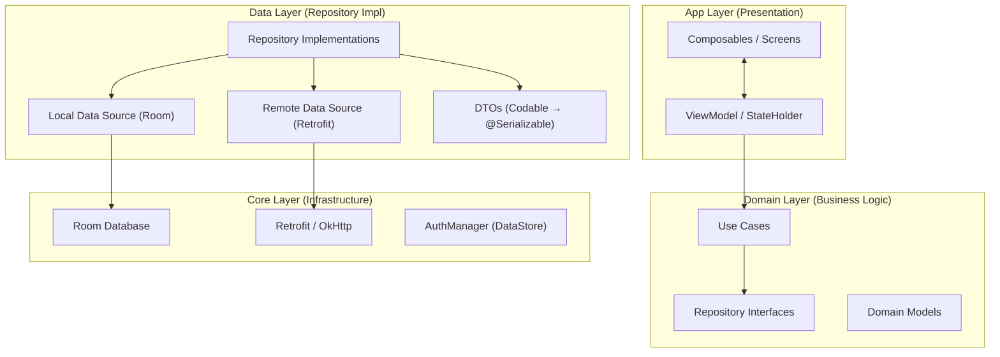

# Casha — Android Port Documentation

> Comprehensive reference for building the Android (Kotlin + Jetpack Compose) version based on the iOS (SwiftUI) codebase.

---

## Table of Contents

1. [Architecture Overview](#architecture-overview)
2. [Design System](#design-system)
3. [Feature Modules](#feature-modules)
4. [Domain Layer — Models](#domain-layer--models)
5. [Domain Layer — Use Cases](#domain-layer--use-cases)
6. [Domain Layer — Repository Protocols](#domain-layer--repository-protocols)
7. [Data Layer — Repository Implementations & DTOs](#data-layer)
8. [Core Layer — Infrastructure](#core-layer)
9. [API Endpoint Catalog](#api-endpoint-catalog)
10. [Service Flows](#service-flows)
11. [Technology Mapping (iOS → Android)](#technology-mapping)

---

## Architecture Overview

Casha follows **Clean Architecture** with 4 layers:



### Directory Structure (Android Equivalent)

```
app/
├── di/                           # Hilt DI modules
├── ui/
│   ├── theme/                    # Colors, Typography, Shapes
│   ├── component/                # Reusable Compose components
│   └── feature/
│       ├── auth/                 # Login, Register, ForgotPassword
│       ├── dashboard/            # Home screen
│       ├── transaction/          # Transaction list & detail
│       ├── addtransaction/       # Add expense/income
│       ├── budget/               # Budget management
│       ├── goaltracker/          # Goals & milestones
│       ├── portfolio/            # Asset tracking
│       ├── liabilities/          # Debt tracking
│       ├── income/               # Income tracking
│       ├── report/               # Charts & analytics
│       ├── profile/              # User settings
│       ├── recommendation/       # AI recommendations
│       └── subscription/         # Play Billing
├── navigation/                   # NavHost & routes
data/
├── remote/
│   ├── api/                      # Retrofit interfaces
│   ├── dto/                      # @Serializable DTOs
│   └── impl/                     # Remote repository impls
├── local/
│   ├── dao/                      # Room DAOs
│   ├── entity/                   # Room entities
│   └── impl/                     # Local repository impls
domain/
├── model/                        # Domain models (data classes)
├── repository/                   # Repository interfaces
└── usecase/                      # Use cases
core/
├── network/                      # OkHttp, interceptors
├── auth/                         # AuthManager (DataStore)
└── util/                         # CurrencyFormatter, DateHelper
```

---

## Design System

### Color Palette

| Token | Usage | Light Mode | Dark Mode |
|:------|:------|:-----------|:----------|
| `cashaPrimary` | Buttons, accents, links | `#2E7D32` | `#81C784` |
| `cashaAccent` | Secondary green | `#4CAF50` | `#43A047` |
| `cashaBackground` | Screen background | `#FFFFFF` | `#121212` |
| `cashaCard` | Card/container background | `#EFF0F1` | `#1F1F1F` |
| `cashaTextPrimary` | Headlines, main text | `#212121` | `#FFFFFF` |
| `cashaTextSecondary` | Subtitles, descriptions | `#757575` | `#A5D6A7` |
| `cashaDanger` | Errors, negative amounts | `#F44336` | `#F44336` |
| `cashaSuccess` | Positive amounts, success | `#2E7D32` | `#2E7D32` |

#### Jetpack Compose Implementation

```kotlin
// ui/theme/Color.kt
object CashaColors {
    // Light
    val primaryLight = Color(0xFF2E7D32)
    val accentLight = Color(0xFF4CAF50)
    val backgroundLight = Color(0xFFFFFFFF)
    val cardLight = Color(0xFFEFF0F1)
    val textPrimaryLight = Color(0xFF212121)
    val textSecondaryLight = Color(0xFF757575)
    val danger = Color(0xFFF44336)
    val success = Color(0xFF2E7D32)

    // Dark
    val primaryDark = Color(0xFF81C784)
    val accentDark = Color(0xFF43A047)
    val backgroundDark = Color(0xFF121212)
    val cardDark = Color(0xFF1F1F1F)
    val textPrimaryDark = Color(0xFFFFFFFF)
    val textSecondaryDark = Color(0xFFA5D6A7)
}
```

### Typography

The iOS app uses **system fonts** with the following scale:

| Style | iOS | Android Equivalent |
|:------|:----|:-------------------|
| Large title | `.largeTitle` | `headlineLarge` (32sp) |
| Headline | `.headline` + `.semibold` | `titleMedium` (16sp, SemiBold) |
| Subheadline | `.subheadline` | `bodyMedium` (14sp) |
| Caption | `.caption` | `labelSmall` (12sp) |
| Balance amount | `.system(size: 36, weight: .bold, design: .rounded)` | Custom `36sp, Bold` |
| Stat amounts | `.system(size: 14, weight: .bold, design: .rounded)` | Custom `14sp, Bold` |

### Reusable UI Components

| iOS Component | Purpose | Android Equivalent |
|:--------------|:--------|:-------------------|
| `CardBalanceView` | Net cashflow card with income/expense breakdown | `BalanceCard` composable |
| `ReportChartView` | Weekly/monthly spend bar charts | `SpendingChart` (Vico/Charts) |
| `GoalCard` | Savings goal summary in horizontal scroll | `GoalCard` composable |
| `CashflowRow` | Transaction/income list item | `CashflowItem` composable |
| `TransactionRow` | Detailed transaction row | `TransactionItem` composable |
| `EmptyStateView` | Empty state with icon + message | `EmptyState` composable |
| `CalculatorView` | Calculator numpad for amount input | `CalculatorKeypad` composable |
| `LoadingShimmerView` | Skeleton loading placeholder | `ShimmerLoading` composable |
| `SnackbarView` | Floating notifications | `Snackbar` (Material3) |
| `ToastView` | Transient messages | `Toast` |
| `SyncBadgeView` | Online/offline indicator | `SyncBadge` composable |
| `SyncBanner` | Sync status banner | `SyncBanner` composable |
| `BudgetAlertBanner` | Budget exceeded alert | `BudgetAlert` composable |
| `SearchView` | Search input | `SearchBar` (Material3) |
| `GoogleButton` | Branded Google sign-in button | `GoogleSignInButton` |
| `ImagePicker` | Photo picker for receipts | `PhotoPicker` (ActivityResult) |
| `InfoRow` | Label + value row | `InfoRow` composable |
| `AssetRow` | Asset list item | `AssetItem` composable |
| `InAppNotificationBanner` | Push notification in-app banner | `NotificationBanner` composable |
| `CustomNotificationBanner` | Custom notification display | `AlertBanner` composable |
| `TransactionReminderBanner` | Daily reminder banner | `ReminderBanner` composable |

---

## Feature Modules

### Module Map (14 Modules)

| Module | Key Screens | State (ViewModel) | Key Features |
|:-------|:------------|:-------------------|:-------------|
| **Auth** | Login, Register, ForgotPassword, SetupCurrency | `LoginState` | Email, Apple, Google SSO |
| **Dashboard** | DashboardView | `DashboardState` | Balance card, report chart, goals, recent transactions |
| **Transactions** | TransactionList, TransactionDetail, EditTransaction | `TransactionState` | Paginated list, search, period filter, CRUD |
| **AddTransaction** | AddTransactionView, AddGoalView | — | Expense/income/goal creation, calculator, category picker |
| **Budget** | BudgetView, BudgetDetail, CreateBudget | `BudgetState` | CRUD, AI recommendations, bulk apply |
| **GoalTracker** | GoalTrackerView, GoalTrackerDetail, AddContribution | `GoalTrackerState` | Savings goals, contributions, categories, progress |
| **Portfolio** | AssetListView, CreateAssetView, AssetDetailView | `PortfolioState` | 28 asset types, quantity-based, PnL, transactions |
| **Liabilities** | LiabilityListView, LiabilityDetailView, AddLiability | `LiabilityState` | Credit cards, loans, statements, installments, insights |
| **Income** | IncomeListView | `IncomeState` | Income tracking, summary |
| **Report** | ReportView | `ReportState` | Category spending, pie charts |
| **Profile** | ProfileView | `ProfileState` | User info, currency, avatar, delete account |
| **Recommendation** | RecommendationView | `RecommendationState` | AI-powered budget/spending recommendations |
| **Subscription** | SubscriptionView | `SubscriptionManager` | Monthly, lifetime plans |
| **Progress** | ProgressView | `ProgressState` | Progress overlay |

### Navigation Structure

```
SplashScreen → Login/Register
                    ↓ (after auth)
              AppLoadingView (syncing all data)
                    ↓ (if no currency)
              SetupCurrencyView
                    ↓ (currency set)
              MainTabBar
                ├── Dashboard (NavigationStack)
                ├── TransactionList (NavigationStack)
                ├── AddTransaction (FAB → Sheet)
                ├── Budget (NavigationStack)
                └── Report (NavigationStack)
```

---

## Domain Layer — Models

### Core Models (36 files)

#### Auth
| Model | Key Fields |
|:------|:-----------|
| `UserCasha` | `id`, `name`, `email`, `phone`, `avatar`, `currency` |
| `LoginResult` | `token: String`, `currency: String?` |
| `UpdateProfileRequest` | `name?`, `email?`, `phone?`, `avatar?`, `currency?` |
| `Country` | Country data for phone input |

#### Transaction & Cashflow
| Model | Key Fields |
|:------|:-----------|
| `TransactionCasha` | `id`, `name`, `category`, `amount`, `datetime`, `isSynced` |
| `AddTransactionRequest` | `name`, `category`, `amount`, `datetime` |
| `UpdateTransactionRequest` | Partial update fields |
| `CashflowEntry` | Unified income/expense entry with `type` enum |
| `CashflowSummary` | `totalIncome`, `totalExpense`, `netCashflow` |
| `SpendingPeriod` | Enum: `.thisMonth`, `.lastMonth`, `.thisYear`, `.allTime`, `.custom` |

#### Budget
| Model | Key Fields |
|:------|:-----------|
| `BudgetCasha` | `id`, `amount`, `spent`, `remaining`, `period`, `startDate`, `endDate`, `category`, `currency` |
| `BudgetSummary` | Aggregated budget stats |
| `NewBudgetReq` | Budget creation request |
| `BudgetAIRecommendation` | AI-suggested budgets |

#### Goals
| Model | Key Fields |
|:------|:-----------|
| `Goal` | `id`, `name`, `targetAmount`, `currentAmount`, `category`, `progress`, `status` |
| `GoalCategory` | `id`, `name`, `icon`, `color`, `isActive` |
| `GoalProgress` | Progress tracking data |
| `GoalStatus` | Enum: active, completed, etc. |

#### Portfolio
| Model | Key Fields |
|:------|:-----------|
| `Asset` | `id`, `type` (28 types), `amount`, `quantity?`, `pricePerUnit?` |
| `AssetTransaction` | Buy/sell/dividend transactions for an asset |
| `PortfolioSummary` | Total value, PnL, asset distribution |

#### Liabilities
| Model | Key Fields |
|:------|:-----------|
| `Liability` | `id`, `name`, `principal`, `currentBalance`, `category`, `interestRate`, `creditLimit?`, `billingDay?`, `dueDay?` |
| `InstallmentPlan` | Converted transactions to installments |
| `UnbilledTransactions` | Credit card unbilled items |

#### Income
| Model | Key Fields |
|:------|:-----------|
| `Income` | `id`, `source`, `amount`, `datetime`, `category` |

#### Category
| Model | Key Fields |
|:------|:-----------|
| `CategoryCasha` | `id`, `name`, `icon`, `color`, `isIncome`, `isDefault` |
| `ChartCategorySpending` | Category spending for pie charts |

#### Chat (AI)
| Model | Key Fields |
|:------|:-----------|
| `ChatParseResult` | Multi-intent AI parsed transactions/incomes |

#### Report
| Model | Key Fields |
|:------|:-----------|
| `SpendingReport` | `thisWeekTotal`, `thisMonthTotal`, `dailyBars`, `weeklyBars` |
| `ReportPeriod` | Report time range definition |

#### Subscription
| Model | Key Fields |
|:------|:-----------|
| `SubscriptionType` | `.none`, `.monthly`, `.lifetime` |
| `SubscriptionStatus` | Active status + expiry |
| `ProductCasha` | Product display info |

---

## Domain Layer — Use Cases

### Use Case Catalog

| Category | Use Case | Description |
|:---------|:---------|:------------|
| **Auth** | `LoginUseCase` | Email login → `LoginResult` |
| | `AppleLoginUseCase` | Apple SSO → `LoginResult` |
| | `GoogleLoginUseCase` | Google SSO → `LoginResult` |
| | `RegisterUseCase` | Email registration → token |
| | `GetProfileUseCase` | Fetch user profile |
| | `UpdateProfileUseCase` | Update name/email/currency |
| | `DeleteAccountUseCase` | Delete user account |
| | `ResetPasswordUseCase` | Send password reset email |
| **Transaction** | `GetRecentTransactionsUseCase` | Fetch recent N transactions (local) |
| | `GetTotalSpendingUseCase` | Period-based spending total (local) |
| | `GetSpendingReportUseCase` | Weekly/monthly chart data (local) |
| | `AddTransactionUseCase` | Create transaction (local+remote) |
| | `GetTransactionsByPeriodUseCase` | Period-filtered list (local) |
| | `SearchTransactionsUseCase` | Full-text search (local) |
| | `GetCategorySpendingUseCase` | Spending by category (local) |
| | `GetTransactionByCategoryUseCase` | Filter by category (local) |
| **Cashflow** | `CashflowSyncUseCase` | **Core**: merge remote+local, bidirectional sync |
| | `GetCashflowHistoryUseCase` | Unified cashflow list (remote) |
| | `GetCashflowSummaryUseCase` | Income/expense/net totals (remote) |
| **Budget** | `GetBudgetsUseCase` | Fetch all budgets |
| | `AddBudgetUseCase` | Create budget |
| | `UpdateBudgetUseCase` | Edit budget |
| | `DeleteBudgetUseCase` | Remove budget |
| | `GetBudgetSummaryUseCase` | Budget stats |
| | `GetBudgetRecommendationsUseCase` | AI recommendations |
| | `ApplyBudgetRecommendationUseCase` | Apply single recommendation |
| | `BulkApplyBudgetRecommendationsUseCase` | Bulk apply |
| **Category** | `SyncCategoriesUseCase` | Sync categories local↔remote |
| | `CreateCategoryUseCase` | Add category |
| | `UpdateCategoryUseCase` | Edit category |
| | `DeleteCategoryUseCase` | Remove category |
| **Income** | `AddIncomeUseCase` | Create income entry |
| | `GetIncomesUseCase` | Fetch income list |
| | `GetIncomeSummaryUseCase` | Income stats |
| | `UpdateIncomeUseCase` | Edit income |
| | `DeleteIncomeUseCase` | Remove income |
| **Subscription** | `VerifySubscriptionUseCase` | Verify with backend |
| | `GetSubscriptionStatusUseCase` | Check premium status |

---

## Domain Layer — Repository Protocols

### Remote Repositories (12)

| Protocol | Methods |
|:---------|:--------|
| `RemoteAuthRepositoryProtocol` | `login`, `appleLogin`, `googleLogin`, `register`, `getProfile`, `updateProfile`, `deleteUser`, `resetPassword` |
| `RemoteTransactionRepositoryProtocol` | `addTransaction`, `fetchTransactionList`, `updateTransaction`, `deleteTransaction` |
| `RemoteBudgetRepositoryProtocol` | CRUD + recommendations + summary |
| `RemoteCategoryRepositoryProtocol` | CRUD + sync |
| `RemoteIncomeRepositoryProtocol` | CRUD + summary |
| `CashflowRepositoryProtocol` | `getHistory`, `getSummary`, `delete`, `update` |
| `GoalTrackerRepositoryProtocol` | Goals CRUD, contributions, categories |
| `PortfolioRepositoryProtocol` | Assets CRUD, transactions, summary |
| `LiabilityRepositoryProtocol` | Liabilities CRUD, statements, payments, insights |
| `ChatRepositoryProtocol` | `parseChat`, `parseChatImage` |
| `RecommendationRepositoryProtocol` | AI budget recommendations |
| `RemoteSubscriptionRepositoryProtocol` | Verify, status check |

### Local Repositories (4)

| Protocol | Purpose |
|:---------|:--------|
| `LocalTransactionRepositoryProtocol` | CoreData CRUD + sync (unsynced tracking, merge) |
| `LocalBudgetRepositoryProtocol` | Local budget cache |
| `LocalCategoryRepositoryProtocol` | Local category cache |
| `LocalIncomeRepositoryProtocol` | Local income cache |

---

## Data Layer

### Base Response Pattern

All API responses follow this envelope:

```kotlin
@Serializable
data class BaseResponse<T>(
    val code: Int,
    val status: String,
    val message: String,
    val data: T?
)
```

### DTO Categories (14)

| Category | DTOs | Mapping |
|:---------|:-----|:--------|
| Auth | `LoginDTO` (`access_token`, `currency`), `ProfileDTO` | `.toLoginResult()`, `.toDomain()` |
| Transaction | `TransactionDTO`, `AddTransactionDTO` | `.toDomain()` |
| Budget | `BudgetDTO`, `BudgetSummaryDTO`, `NewBudgetDTO` | `.toDomain()` |
| Cashflow | `CashflowDTO` | `.toDomain()` → `CashflowEntry` |
| Category | `CategoryDTO`, `CreateCategoryDTO` | `.toDomain()` |
| Chat | `ChatParseResponseDTO` | AI multi-intent response |
| Income | `IncomeResponseDTO`, `IncomeSummaryDTO` | `.toDomain()` |
| Liability | `LiabilityDTO`, `StatementDTO` | `.toDomain()` |
| Milestone/Goal | `GoalDTO` | `.toDomain()` |
| Portfolio | `AssetDTO`, `AssetTransactionDTO`, `PortfolioSummaryDTO` | `.toDomain()` |
| Recommendation | `RecommendationDTO` | AI recommendation |
| Report | `ReportDTO`, `ChartBarDTO` | Chart data |
| Subscription | `SubscriptionStatusDTO` + 6 others | StoreKit/Play Billing mapping |

### Remote Repository Implementations (12 files)

Each implementation follows this pattern:
1. Inject `APIClient` (or `NetworkClient`)
2. Build request with endpoint, headers (Bearer token), body
3. Decode `BaseResponse<DTO>` 
4. Map `.data!.toDomain()` to return domain model

---

## Core Layer

### Networking

| iOS | Android |
|:----|:--------|
| `APIClient` (Alamofire) | `Retrofit` + `OkHttp` |
| `Endpoint` (path + method) | Retrofit `@GET/@POST` interface |
| `NetworkClient` protocol | Retrofit service interface |
| `NetworkMonitor` | `ConnectivityManager` |

### Persistence

| iOS | Android |
|:----|:--------|
| CoreData | Room Database |
| `CoreDataStack` | `RoomDatabase` |
| `TransactionEntity` | `@Entity` |
| Entity mappers | `@TypeConverter` + mapper functions |
| `AuthManager` (UserDefaults) | `DataStore` (Preferences) |

### Local Entities (4)

| Entity | Key Columns |
|:-------|:------------|
| `TransactionEntity` | `id`, `name`, `category`, `amount`, `datetime`, `isSynced`, `remoteId` |
| `BudgetEntity` | Budget cache with period, amounts |
| `CategoryEntity` | `id`, `name`, `icon`, `color`, `isIncome`, `isDefault`, `isSynced` |
| `IncomeEntity` | `id`, `source`, `amount`, `datetime`, `isSynced` |

---

## API Endpoint Catalog

### Auth (`auth/`)

| Method | Path | Description |
|:-------|:-----|:------------|
| `POST` | `auth/login` | Email login → `{access_token, currency}` |
| `POST` | `auth/apple` | Apple SSO |
| `POST` | `auth/google` | Google SSO |
| `POST` | `auth/signup` | Register |
| `POST` | `auth/forgot-password` | Reset password |
| `GET` | `auth/profile` | Get profile |
| `PATCH` | `auth/profile/` | Update profile |
| `DELETE` | `auth/profile/` | Delete account |

### Transactions (`transactions/`)

| Method | Path | Description |
|:-------|:-----|:------------|
| `POST` | `transactions/create` | Create transaction |
| `GET` | `transactions` | List transactions |

### Income (`income/`)

| Method | Path | Description |
|:-------|:-----|:------------|
| `POST` | `income` | Create income |
| `GET` | `income` | List incomes |
| `GET` | `income/summary` | Income summary |

### Cashflow (`cashflow/`)

| Method | Path | Description |
|:-------|:-----|:------------|
| `GET` | `cashflow/history` | Unified history (income+expense) |
| `GET` | `cashflow/summary` | Net cashflow summary |
| `PATCH` | `cashflow/{type}/{id}` | Update cashflow item |
| `DELETE` | `cashflow/{type}/{id}` | Delete cashflow item |

### Budgets (`budgets/`)

| Method | Path | Description |
|:-------|:-----|:------------|
| `GET` | `budgets/` | List budgets |
| `GET` | `budgets/summary` | Budget summary |
| `POST` | `budgets/` | Create budget |
| `PUT` | `budgets/{id}` | Update budget |
| `DELETE` | `budgets/{id}` | Delete budget |
| `GET` | `budgets/recommendations` | AI recommendations |
| `POST` | `budgets/apply-recommendations` | Bulk apply |
| `POST` | `budget-recommendations/{id}/apply` | Apply single |

### Goals (`goals/`)

| Method | Path | Description |
|:-------|:-----|:------------|
| `POST` | `goals` | Create goal |
| `GET` | `goals` | List goals |
| `GET` | `goals/summary` | Goal summary |
| `GET` | `goals/{id}` | Goal details |
| `PATCH` | `goals/{id}` | Update goal |
| `DELETE` | `goals/{id}` | Delete goal |
| `POST` | `goals/{id}/contributions` | Add contribution |
| `GET` | `goals/{id}/contributions` | Get contributions |
| `GET` | `goals/categories` | List goal categories |
| `POST` | `goals/categories` | Create category |
| `PATCH` | `goals/categories/{id}` | Update category |
| `DELETE` | `goals/categories/{id}` | Delete category |
| `GET` | `goals/categories/{id}` | Get category |

### Portfolio (`assets/`)

| Method | Path | Description |
|:-------|:-----|:------------|
| `POST` | `assets` | Create asset |
| `GET` | `assets` | List assets |
| `GET` | `assets/portfolio-summary` | Portfolio summary |
| `PATCH` | `assets/{id}` | Update asset |
| `DELETE` | `assets/{id}` | Delete asset |
| `POST` | `assets/{assetId}/transactions` | Add asset transaction |
| `GET` | `assets/{assetId}/transactions` | Get asset transactions |

### Liabilities (`liabilities/`)

| Method | Path | Description |
|:-------|:-----|:------------|
| `POST` | `liabilities` | Create liability |
| `GET` | `liabilities` | List liabilities |
| `GET` | `liabilities/summary` | Summary |
| `GET` | `liabilities/{id}` | Details |
| `DELETE` | `liabilities/{id}` | Delete |
| `POST` | `liabilities/{id}/payments` | Record payment |
| `GET` | `liabilities/{id}/payments` | Payment history |
| `POST` | `liabilities/{id}/transactions` | Create transaction |
| `GET` | `liabilities/{id}/statements/latest` | Latest statement |
| `GET` | `liabilities/{id}/statements` | All statements |
| `GET` | `liabilities/{id}/statements/{stmtId}` | Statement detail |
| `GET` | `liabilities/{id}/unbilled` | Unbilled transactions |
| `GET` | `liabilities/{id}/insights` | AI insights |
| `POST` | `liabilities/{id}/transactions/{txId}/convert` | Convert to installment |

### Categories (`categories/`)

| Method | Path | Description |
|:-------|:-----|:------------|
| `GET` | `categories` | List categories |
| `POST` | `categories` | Create category |
| `PATCH` | `categories/{id}` | Update |
| `DELETE` | `categories/{id}` | Delete |
| `GET` | `categories/{id}` | Get by ID |

### Chat AI (`chat/`)

| Method | Path | Description |
|:-------|:-----|:------------|
| `POST` | `chat/parse` | Parse text into transactions |
| `POST` | `chat/parse-image` | Parse receipt image (multipart) |

### Subscriptions (`subscriptions/`)

| Method | Path | Description |
|:-------|:-----|:------------|
| `POST` | `subscriptions/verify` | Verify purchase receipt |
| `GET` | `subscriptions/status` | Check subscription status |

---

## Service Flows

### 1. Login Flow

```
┌──────────┐  POST auth/login    ┌──────────┐
│  Login   │ ──────────────────► │  Server  │
│  Screen  │                     │          │
└────┬─────┘ ◄────────────────── └──────────┘
     │         {access_token, currency}
     │
     ▼
  Save token → AuthManager (DataStore)
  Save currency → UserDefaults/DataStore ("selectedCurrency")
     │
     ▼
  AppLoadingView → parallel:
     ├── profileState.refreshProfile() → GET auth/profile
     ├── dashboardState.refreshDashboard()
     └── subscriptionManager.checkSubscriptionStatus()
     │
     ▼ (all complete)
  MainTabBar
```

### 2. Offline-First Sync Flow

```
USER CREATES TRANSACTION (Offline):
  UI → ViewModel → UseCase → LocalRepository
                              └── Room (isSynced = false)

NETWORK BECOMES AVAILABLE:
  NetworkMonitor detects connectivity
    └── CashflowSyncUseCase.syncAndFetch()
        ├── 1. Get unsynced local items
        ├── 2. POST each to server → get server ID
        ├── 3. Mark local as synced (isSynced = true)
        ├── 4. Fetch remote items
        └── 5. Merge remote into local (dedup by ID)
```

### 3. Dashboard Refresh Flow

```
DashboardState.refreshDashboard():
  ├── CashflowSyncUseCase.syncAndFetch()  ← bidirectional sync
  ├── GetRecentTransactionsUseCase (local, limit: 5)
  ├── GetTotalSpendingUseCase (local, period)
  ├── GetSpendingReportUseCase (local, chart data)
  ├── GetCashflowSummaryUseCase (remote, net cashflow)
  └── NetworkMonitor.isOnline → update unsyncedCount
```

### 4. Budget Recommendations Flow

```
GET budgets/recommendations → AI-analyzed spending
  └── User selects recommendations
      └── POST budgets/apply-recommendations (bulk)
          └── Server creates budgets → refresh budget list
```

### 5. Auth Headers Pattern

All authenticated requests include:
```
Authorization: Bearer {token}
Content-Type: application/json
Accept-Language: {device_locale}   // for localized AI responses
```

---

## Technology Mapping

| Concern | iOS (Current) | Android (Target) |
|:--------|:-------------|:-----------------|
| **UI Framework** | SwiftUI | Jetpack Compose |
| **State Management** | `@StateObject` + `EnvironmentObject` | `ViewModel` + `StateFlow` |
| **Navigation** | `NavigationStack` | `NavHost` + `NavController` |
| **DI** | Manual `DependencyContainer` | **Hilt** (recommended) |
| **Networking** | Alamofire + `APIClient` | **Retrofit** + OkHttp |
| **Local DB** | CoreData | **Room** |
| **Key-Value** | `UserDefaults` | **DataStore** (Preferences) |
| **Auth Token** | `AuthManager` (Keychain-like) | `EncryptedSharedPreferences` / DataStore |
| **SSO** | Sign in with Apple, Google | Google Sign-In, Credential Manager |
| **Push Notif** | APNs + FCM | **FCM** (same backend) |
| **Subscriptions** | StoreKit 2 | **Google Play Billing** |
| **Image Upload** | `PHPicker` | `ActivityResultContracts.PickVisualMedia` |
| **Concurrency** | `async/await` + `TaskGroup` | `coroutines` + `Flow` |
| **Monitoring** | Crashlytics | **Crashlytics** (same) |
| **Localization** | `.xcstrings` (11 languages) | `strings.xml` (11 languages) |
| **Network Monitor** | `NWPathMonitor` | `ConnectivityManager` |

### Supported Languages (11)
`en`, `id`, `ar`, `de`, `es`, `fr`, `hi`, `ja`, `ko`, `pt-BR`, `zh-Hans`

---

*Generated from Casha iOS codebase analysis — February 20, 2026*
